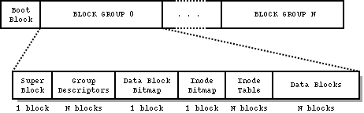

# SOA

<p align="center">
  <a href="https://github.com/VXGamez/SOA/releases/tag/FASE1">
  
  </a>
<a href="https://github.com/VXGamez/SOA/releases/tag/FASE2">
  
  </a>
<a href="https://github.com/VXGamez/SOA/releases/tag/FASE3">
  
  </a>
<a href="https://github.com/VXGamez/SOA/releases/tag/FASE4">
  
  </a>
</p>

<details open="open">
  <summary><h2 style="display: inline-block">Taula de Continguts</h2></summary>
  <ol>
    <li><a href="#com-compilar">Com Compilar</a></li>
    <li><a href="#explicació-dels-sistemes-de-fitxers">Explicació dels Sistemes de Fitxers</a>
      <ul>
        <li><a href="#ext">EXT</a></li>
        <li><a href="#fat16">FAT16</a></li>
      </ul>
    </li>
    <li>
      <a href="#explicació-de-la-pràctica">Explicació de la pràctica</a>
      <ul>
        <li><a href="#requeriments">Requeriments</a></li>
        <li><a href="#disseny">Disseny</a></li>
        <li><a href="#estructures-de-dades-usades">Estructures de dades Usades</a></li>
        <li><a href="#proves-realitzades">Proves realitzades</a></li>
        <li><a href="#problemes-observats">Problemes observats</a></li>
        <li><a href="#estimació-temporal">Estimació Temporal</a></li>
      </ul>
    </li>
    <li><a href="#explicació-i-valoració-del-git">Explicació i valoració del GIT</a></li>
    <li><a href="#conclusions-generals">Conclusions generals</a></li>
  </ol>
</details>

## Com Compilar

1. Per compilar caldrà emprar la comanda make:
   ```sh
   make
   ```
   En executar-se, es crearà el executable p1


2. Per executar p1 escriure les següents comandes, en funció del mode desitjat:

   **· Mode /info**
   ```sh
   ./p1 /info <nom_volum>
   ```
   **· Mode /find**
   ```sh
   ./p1 /find <nom_volum> <fitxer_a_trobar>
   ```

   En cas que es vulguin afegir volums addicionals caldrà ubicar-los dins la carpeta fitxers.

## Explicació dels Sistemes de Fitxers

Els sistemes de fitxers amb els que se’ns ha demanat que treballem tenen les seves similituds entre sí, però per una millor comprensió s’han explicat per separat però amb la intenció de establir una relació entre ells ja que tenen un plantejament similar.


### EXT


Un sistema de fitxers EXT es divideix en una sèrie de grups de blocs. Per reduir les dificultats de rendiment a causa de la fragmentació, l'assignació de blocs s'esforça molt per mantenir els blocs de cada fitxer dins del mateix grup, reduint així els temps de cerca. La mida d’un grup de blocs s’especifica als blocs superblock.s_blocks_per_group, tot i que també es pot calcular com a 8 * block_size_in_bytes. Amb la mida de bloc predeterminada de 4KiB, cada grup contindrà 32.768 blocs, per a una longitud de 128 MB. El nombre de grups de blocs és la mida del dispositiu dividida per la mida d’un grup de blocs.

Pel cas especial del grup de blocs 0 (superblock) , els primers 1024 bytes no s’utilitzen d'aquesta manera el superblock començarà amb un desplaçament de 1024 bytes, sigui el bloc que sigui (normalment 0).

Ext4 funciona principalment amb el superblock i els descriptors de grups que es troben al grup de blocs 0. La ubicació de la taula d’inodes ve donada per bg_inode_table. És un rang continu de blocs prou gran com per contenir s_inodes_per_group * sb.s_inode_size bytes.



Pel que fa a l’ordenació d’elements d’un grup de blocs, generalment s’estableix que el superbloc i la taula de descriptors de grups, si hi ha, estaran al principi del grup de blocs. Els mapes de bits i la taula d’inodes estan a continuació. L’espai sobrant s’utilitza per a blocs de dades de fitxers, mapes de blocs indirectes, blocs d’arbre d’extensió i atributs ampliats. Aquesta estructura es repeteix per cada Block Group fins al Block Group N, tal i com podem veure a la imatge.

La taula d’inodes té N inodes, i cada inode conté un array de blocs situats a la part de blocs de dades. Cada un d’aquests blocs, conté un seguit de entrades de directori. És a dir, un inode conté aquest array de blocs, i repartit al llarg d’aquest array estan tots els elements que conté el inode, ja siguin directoris o fitxers. A la imatge a continuació he posat un exemple de com és aquesta estructura.


Podem veure com el inode ROOT, que és el 2 en el cas de EXT, apunta a aquest block[0] (n’hi ha 14 més però per poder il·lustrar-ho correctament només estic agafant el primer bloc). En el bloc 0 del inode 2 trobem 5 elements, els directoris . i .., els fitxers picture.jpg i test.txt, i finalment el directori home. Per accedir a aquest directori es fa de la mateixa manera que per l’inode root. Es visita el inode de home, el 13, i des-de l’inode 13 es recorre el seu array de blocs. I així repetidament.


### FAT16

La taula d'assignació de fitxers (File Allocation Table - FAT) és una taula emmagatzemada en un disc dur o disquet que indica el fitxer estat i ubicació de tots els clústers de dades que hi ha al disc. La taula d'assignació de fitxers pot ser es considera la "taula de continguts" d'un disc. Si la taula d'assignació de fitxers es fa malbé o es perd, llavors a el disc no es pot llegir. En el cas de FAT16, és el sistema de fitxers d’un disquet. El número "16" es deriva del fet que el FAT consta d'entrades de 16 bits.

L’espai d’emmagatzematge d’un disquet es divideix en unitats anomenades sectors. En dispositius d'emmagatzematge més grans, a un conjunt de sectors formen un clúster. No obstant això, per al disquet, el nombre de sectors en un clúster és un. A més, la mida d'un sector (i, per tant, d'un clúster) és de 512 bytes per a un disquet.


Expandit:


El disseny d'un disquet FAT-16 consta de quatre seccions principals: el Boot Sector (A l’àrea reservada), les taules FAT, el directori root i l'àrea de dades. A l’àrea de dades trobarem també tots els subdirectoris del sistema.


El Boot Sector, o sector d'arrencada, és en el primer sector (sector 0) del volum o del disc. Conté informació específica sobre la resta d'organitzacions del sistema de fitxers, per exemple quantes còpies de taules FAT hi ha, com de gran és un sector, quants sectors hi ha en un clúster, etc.

Les taules FAT contenen punters a tots els clústers del disc e indiquen el número del següent clúster de la cadena de clústers actual així com el final de la cadena de clúster, si un clúster està buit o si aquest té errors. Les taules FAT són l'únic mètode per trobar la ubicació de fitxers i directoris a la resta del disc. Normalment, hi ha dues còpies redundants de la taula FAT al disc per finalitats de seguretat i recuperació de dades.

El directori root és el directori principal del disc. A diferència d'altres directoris situats a l'àrea de dades del disc, el directori root té una mida finita (per a FAT16, 14 sectors * 16 entrades de directori per sector = 224 entrades possibles), restringint la quantitat total de fitxers o directoris que es poden crear-hi.


A l'àrea de dades, el primer sector o clúster de l'àrea de dades correspon al clúster 2 del fitxer sistema. L'àrea de dades conté dades de fitxers i directoris i abasta la resta de sectors del disc.

Cada clúster té un seguit de directory entries, de manera similar al sistema EXT, on trobarem la informació rellevant dels fitxers que conté.


## Explicació de la pràctica

### Requeriments

La pràctica no té gaires requeriments. Es demana que pel seu disseny, es faci servir un sistema per mòduls, per poder tenir separada la implementació de cada sistema de fitxers.

Més enllà d’això, no ha calgut gaire altre cosa. S’ha implementat en C. I el que sí caldrà es tenir els volum de fitxers en els directoris indicats per fer que funcioni.


### Disseny

El desenvolupament de la pràctica s’ha dividit per fases. I al llarg d’aquestes fases s’ha variat el disseny de forma incremental. Inicialment, es va plantejar de tal manera que es realitzessin lectures directes a estructures en C des de els offsets indicats per la teoria d’aquell sistema de fitxers. De tal manera que, per llegir el Superblock de EXT o el BootSector de FAT, tenia una estructura amb tots els camps de cada un, em situava en el offset pertinent i realitzava la lectura.

Més endavant me’n he adonat de que aquest sistema no és el millor sempre donat que en el cas de FAT, per algun motiu, en llegir directament a la estructura no funcionava però sí llegint camp a camp. Suposo que per alguna problemàtica de padding. Pel que lo únic que ha variat de la fase 1 a les següents ha estat la manera en que llegeixo el BootSector.

Però, per les següents fases estar clar que caldria pensar una mica més enllà d’aquests blocs inicials. Per la fase 2, donat que compartia funcionalitat amb la 3 vaig mirar de fer un disseny bastant robust i que pogués reutilitzar tant per la 3 com per la 4. És per això que vaig mirar de fer funcions genèriques.

En el cas de EXT, tenim dues funcions que permeten el funcionament de la pràctica. La funció EXT_trobaInode, que ubica un inode N al sistema de fitxers i el retorna desat a la seva estructura. La funció EXT_findFile, encarregada de, des d’un inode N, navegar per tot el seu array de blocs i directory entries cridant-se a si mateixa en cas de trobar algun directori canviant l’origen de la funció del inode N original, a el inode del directori gràcies a la funció trobaInode.

Pel cas de fat he emprat un funcionament similar però no ha fet falta una funció com trobaInode donat que no tenim inodes en aquest sistema de fitxers. A fat amb la funció findFile ja en tenim suficient, ja que reb un punt d’inici, i recorre totes les directory entries del clúster que rep, inicialment el root però a mesura que es fan crides recursives son els dels sub-directoris.

Finalment, pel que fa a la eliminació de fitxers, s’han emprat les funcions comentades anteriorment per ubicar-los, però ara en trobar el fitxer, s’han volgut realitzar un seguit de modificacions. Pel cas de FAT simplement s’ha afegit a la casella 0 del nom el caràcter hexadecimal 0x0e5, marcant aquella directory entry com a eliminada.

Pel que fa a EXT, ha estat una mica més complicat degut a que hi havia un nombre més elevat de modificacions a realitzar. Primerament he incrementat la reclen de la directory entry anterior a la del fitxer a el seva mida + la mida del fitxer a eliminar. A més, he posat el inode de la directory entry a eliminar a 0 després d’haver visitat aquell inode i posat tot el seu array de i_blocks a 0, la seva mida a 0, posar en els flags el valor: 0x040, afegir-li una hora d’eliminació, shiftar el inode bitmap per acabar de eliminar el inode, i finalment incrementar en el superblock el numero de inodes lliures.


### Estructures de dades Usades

Tal i com s'indica al disseny de la pràctica, s'han llegit les regions amb una sola lectura desant-se completament a les estructures. A continuació hi ha totes les estructures emprades, des de les del Superblock o BootSector de la fase 1, a totes les necessàries per fer funcionar la fase 2, 3 i 4.


   ```c
    typedef struct {
      uint32_t s_inodes_count;      
      uint32_t s_blocks_count;      
      uint32_t s_r_blocks_count;    
      uint32_t s_free_blocks_count;
      uint32_t s_free_inodes_count;
      uint32_t s_first_data_block;  
      uint32_t s_log_block_size;    
      int32_t  s_log_frag_size;     
      uint32_t s_blocks_per_group;  
      uint32_t s_frags_per_group;   
      uint32_t s_inodes_per_group;  
      uint32_t s_mtime;             
      uint32_t s_wtime;             
      uint16_t s_mnt_count;         
      uint16_t s_max_mnt_count;     
      uint16_t s_magic;             
      uint16_t s_state;             
      uint16_t s_errors;            
      uint16_t s_minor_rev_level;   
      uint32_t s_lastcheck;         
      uint32_t s_checkinterval;     
      uint32_t s_creator_os;        
      uint32_t s_rev_level;         
      uint16_t s_def_resuid;        
      uint16_t s_def_resgid;
      uint32_t s_first_ino;         
      uint16_t s_inode_size;        
      uint16_t s_block_group_nr;    
      uint32_t s_feature_compat;    
      uint32_t s_feature_incompat;  
      uint32_t s_feature_ro_compat;
      uint8_t  s_uuid[16];          
      char     s_volume_name[16];   
      unsigned char     s_last_mounted[64];
      uint32_t s_algo_bitmap;  
   }SB;

   typedef struct {
      unsigned char BS_jmpBoot[3];     
      char BS_OEMName[8];              
      unsigned short BPB_BytsPerSec;   
      unsigned char BPB_SecPerClus;    
      unsigned short BPB_RsvdSecCnt;   
      unsigned char BPB_NumFATs;       
      unsigned short BPB_RootEntCnt;   
      unsigned short BPB_TotSec16;     
      unsigned char BPB_Media;         
      unsigned short BPB_FATSz16;      
      unsigned short BPB_SecPerTrk;    
      unsigned short BPB_NumHeads;     
      int BPB_HiddSec;                 
      int BPB_TotSec32;                
      unsigned char BS_DrvNum;         
      unsigned char BS_Reserved1;      
      unsigned char BS_BootSig;        
      char BS_VolLab[11];              
      char BS_FilSysType[8];           
   }BootSector;

   typedef struct {
      char long_name[8];
      char extension[3];
      uint8_t fileAttr;
      uint8_t reserved[10];
      uint16_t tChange;
      uint16_t dChange;
      uint16_t firstCluster;
      uint32_t fSize;
   }dir_entry;

   typedef struct{
      uint32_t bg_block_bitmap;
      uint32_t bg_inode_bitmap;
      uint32_t bg_inode_table;
      uint16_t bg_free_blocks_count;
      uint16_t bg_free_inodes_count;
      uint16_t bg_used_dirs_count;
      uint16_t bg_pad;
      unsigned char bg_reserved[12];
   }GroupDescriptor;

   typedef struct {
      uint16_t i_mode;       
      uint16_t i_uid;        
      uint32_t i_size;       
      uint32_t i_atime;      
      uint32_t i_ctime;      
      uint32_t i_mtime;      
      uint32_t i_dtime;      
      uint16_t i_gid;        
      uint16_t i_links_count;
      uint32_t i_blocks;     
      uint32_t i_flags;      
      uint32_t i_osd1;       
      uint32_t i_block[15];  
      uint32_t i_generation;
      uint32_t i_file_acl;   
      uint32_t i_dir_acl;    
      uint32_t i_faddr;      
      unsigned char i_osd2[12];
   } inodo;

   typedef struct{
      uint32_t inode;
      uint16_t rec_len;
      uint8_t name_len;
      uint8_t file_type;
   }ino_block;
   ```
### Proves realitzades

De cara a aquesta fase les úniques proves realitzades han estat amb els fitxers proveïts al estudy. Aquests han estat els únics que he llegit i consultat al llarg del desenvolupament de la F1.

Se’ns ha donat també un link amb la explicació de com realitzar el nostre propi sistema de fitxers però no he estat capaç de fer-ho funcionar.

El que sí he fet ha estat muntar els diferents sistemes mitjançant una màquina virtual d’ubuntu a una carpeta, per poder explorar el contingut dels sistemes de fitxers. Aquest muntatge m’ha portat molts problemes ja que al principi no havia estat capaç de fer-ho tot i ser una comanda molt senzilla. Va resultar que el problema es que no podia muntar fitxers que es troben al mac a carpetes del mac, ni fitxers que es troben al mac a carpetes del ubuntu, tot i que la meva màquina virtual em doni una falsa il·lusió de tenir explorador de fitxers compartit.
Per poder muntar-ho he hagut de desplaçar els volums a carpetes de sistema de ubuntu i muntar-ho des-de allà, i així sí he pogut explorar el contingut dels volums.

### Problemes observats

Pel que fa als problemes, hi ha hagut uns quants. Principalment per entendre com realitzar cada fase a nivell intuïtiu, no pràctic, és a dir, entendre què havia de fer en cada moment.

He realitzar nombroses cerques a internet i visites a dubtes per poder entendre exactament com navegar els diferents sistemes de fitxers i entendre com plantejar cada fase.

Més enllà de problemes de plantejament, he tingut problemes com el esmenat a la part de proves realitzades, on per comprovar el contingut dels volums se’ns va recomanar realitzar un mount dels diferents sistemes de fitxers però vaig estar capaç de fer funcionar aquest mount ni des del meu MacBook, ni des-de matagalls/montserrat, ni des-de la meva màquina virtual ubuntu.

Va ser fent una bona recerca que vaig trobar que no podia fer muntatge de volums “cross platform”, és a dir, muntar fitxers del mac al ubuntu, o del mac al mac. Havien de ser fitxers que es trobessin al ubuntu i que el punt de muntatge s’hi trobés també completament al ubuntu.

### Estimació Temporal

Pel que fa al temps emprat, es pot consultar al històric de GitHub però el que més he trigat en fer ha estat la F2. Aquesta és la fase més llarga ja que és la que ha requerit més temps per plantejar i enfocar de cara a que les properes fases poguessin ser més senzilles.


Tal i com es pot veure en aquest gràfic, la F2 ha estat la que ha requerit més temps ja que és la fase en la que he plantejat les fases 3 i 4 també. La fase 1 va tenir un temps significatiu però res comparat amb les demés ja que era només llegir una regió al inici del fitxer. La complicació estava en que era el primer contacte amb aquests sistemes de fitxers.


## Explicació i valoració del GIT

Git com a sistema de control de versions és molt comú a la realització de projectes, i és un entorn de treball real i que ens trobarem el dia de demà a l'empresa que sigui que treballem. M'ha servit per estructura el projecte amb diferents branques, diferents espais on he implementat individualment funcionalitats abans de ajuntar-les al projecte final.

S’ha intentat que per cada fase del projecte hi hagués un seguit de branques on s’implementés la funcionalitat desitjada per un sistema de fitxers, i després a l’altre branca per l’altre, mantenint així una separació lògica.


## Conclusions generals

Aquesta pràctica ha estat una introducció molt interessant als sistemes de fitxers, i m’ha ajudat a entendre molt millor com s’endrecen els fitxers en un sistema operatiu i les diferències entre sí. Ja havia treballat anteriorment la teoria que s'ha treballat a SOA a ASO però clarament no amb aquest nivell de profunditat ja que allà treballàvem amb comandes que ens donaven tota la informació que cerquem en aquesta pràctica.

Potser el més interessant ha estat el a partir de un fitxer, que és un volum de fitxers, poder navegar les dades binàries consultant valors reals i fitxers reals que ifns ara només havia vist a través de una interfície gràfica proveïda pel sistema operatiu, no ho havia vist mai a aquest baix nivell.

Em resulta molt curiós també com els dos sistemes de fitxers funcionen de una manera o altre amb un sistema de punters a diferents blocs del sistema operatiu, i com això te un cost molt baix a nivell de temps d’accés pel sistema operatiu ja que molts dels accessos son gairebé directes. 


